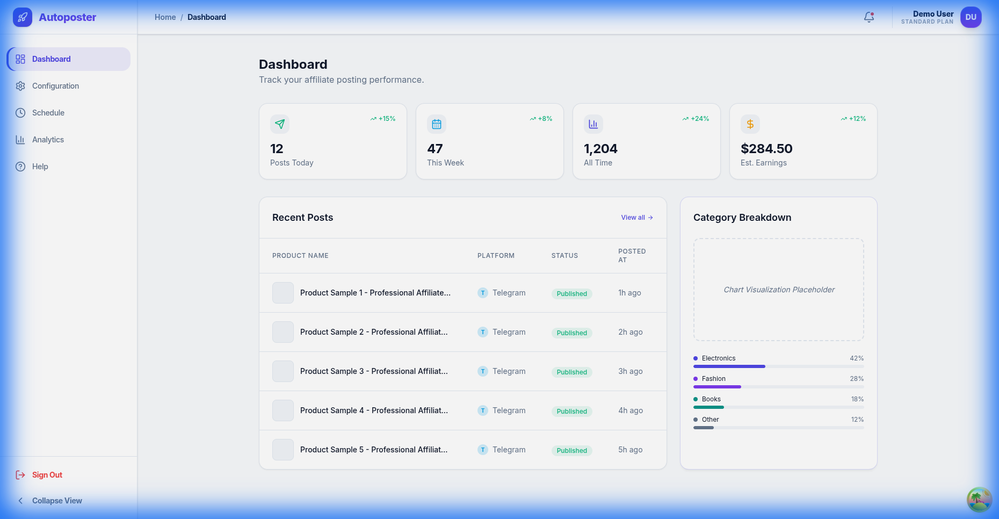

# Authentication Flow Design & Specification

## 1. Overview
The authentication flow is designed to be high-trust, frictionless, and visually premium. It follows Material Design 3 principles with a focus on "Light Mode" aesthetics, emphasizing clarity and bold call-to-actions.

## 2. User Experience (UX) Flow
1. **Entry**: User lands on `/login`.
2. **Identification**: User enters email.
3. **Verification**: User enters password. 
   - *Option*: OAuth (Google/Github) for 1-click entry.
4. **Onboarding**: New users redirect to `/register`, then to the Setup Wizard (`/setup`).
5. **Session Management**: Auth state persists via `localStorage` (V1) or Secure HttpOnly Cookies (V2+).

## 3. Screen Specifications

### 3.1 Login Page (`/login`)
- **Layout**: 50/50 Split (Brand Panel | Auth Card).
- **Brand Panel**: 
  - Indigo-to-Violet gradient (`#4F46E5` → `#7C3AED`).
  - Rocket icon with "Autoposter" branding.
  - Value Proposition: "Automate Your Affiliate Empire."
- **Auth Card**:
  - Clean white surface (`elevation-1`).
  - Input fields with icons (`Mail`, `Lock`).
  - Password visibility toggle (`Eye`/`EyeOff`).
  - "Remember me" checkbox.
  - Social Login buttons (Google, Github).

### 3.2 Registration Page (`/register`)
- **Layout**: Shared with Login for brand consistency.
- **Fields**: 
  - Full Name (`User` icon).
  - Email (`Mail` icon).
  - Password (`Lock` icon).
- **Action**: Redirects to Setup Wizard immediately after success.

## 4. Visual Assets (Prototypes)

### Login View Mockup

### Dashboard Entry Mockup

## 5. Technical Design Tokens (Auth Specific)
- **Primary Action**: `bg-brand-primary` (`#4F46E5`), `hover:bg-brand-primary/90`.
- **Input Focus**: Border `#4F46E5`, Ring `rgba(79, 70, 229, 0.1)`.
- **Transitions**: 500ms slide-in for page entry, 200ms for button hover states.
